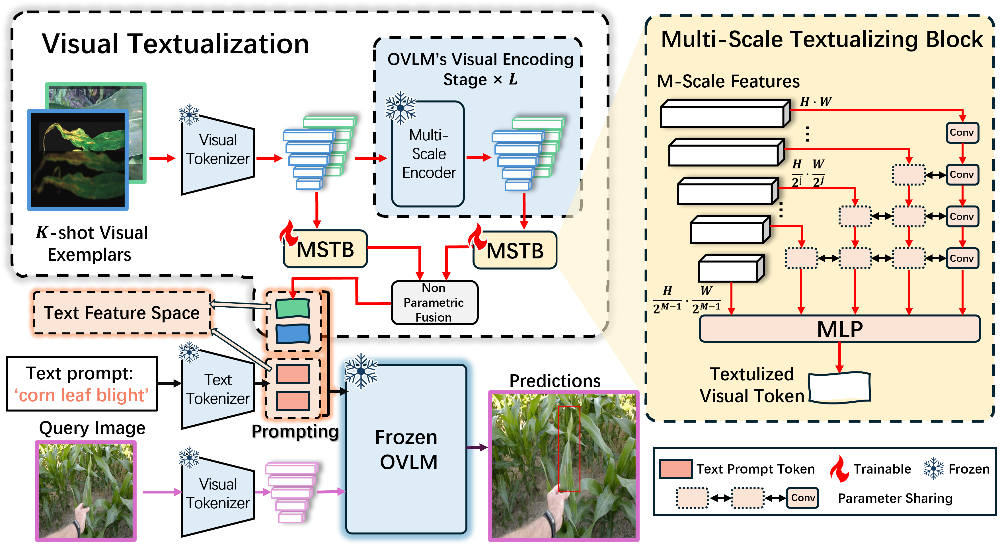

# VisTex-OVLM: Visual Textualization for Image Prompted Object Detection

[](https://arxiv.org/abs/2506.23785)

## Overview
This repository contains the implementation of our ICCV 2025 paper **"Visual Textualization for Image Prompted Object Detection"**. We propose VisTex-OVLM, a novel image prompted object detection method that introduces visual textualization -- a process that projects a few visual exemplars into the text feature space to enhance Object-level Vision-Language Models' (OVLMs) capability in detecting rare categories that are difficult to describe textually and nearly absent from their pre-training data, while preserving their pre-trained object-text alignment. Specifically, VisTex-OVLM leverages multi-scale textualizing blocks and a multi-stage fusion strategy to integrate visual information from visual exemplars, generating textualized visual tokens that effectively guide OVLMs alongside text prompts. Unlike previous methods, our method maintains the original architecture of OVLM, maintaining its generalization capabilities while enhancing performance in few-shot settings. VisTex-OVLM demonstrates superior performance across open-set datasets which have minimal overlap with OVLM's pre-training data and achieves state-of-the-art results on few-shot benchmarks PASCAL VOC and MSCOCO.



Key Features:
- Multi-scale textualizing blocks (MSTBs) for visual-to-text feature projection
- Non-parametric multi-stage fusion strategy
- Maintains original OVLM architecture and object-text alignment
- Achieves state-of-the-art performance on COCO FSOD benchmarks

## Installation
The code is built upon the GLIP framework. Installation steps:

```bash
# 1. Clone this repository
git clone https://github.com/yourusername/VisTex-OVLM.git
cd VisTex-OVLM

# 2. Create conda environment (Python 3.7 recommended)
conda create -n vistex python=3.7.12
conda activate vistex

# 3. Install dependencies
python setup.py develop
```
This will install the modified maskrcnn_benchmark package from our repository.

## Datasets

For COCO few-shot experiments (60 training classes, 20 novel test classes):

Download COCO 2017 dataset images: train2017+val2017


Organize the dataset structure:
```bash
DATASET/
└── coco0/
    ├── annotations/
    │   ├── train_SPLIT_0.json  # provided in repo
    │   └── val_SPLIT_0.json    # provided in repo
    ├── train2017/              # extracted from zip
    └── val2017/                # extracted from zip
```
## Usage Instructions

To train VisTex-OVLM on COCO few-shot setting:


```bash
python tools/train_net.py \
    --config-file configs/pretrain/glip_Swin_L.yaml \
    --dataset_num=1 \
    --restart True \
    --use-tensorboard \
    --override_output_dir fewshot_coco \
    DATASETS.TRAIN "('coco_grounding_train_SPLIT0',)" \
    DATASETS.TEST "('coco_2017_val_SPLIT0',)" \
    MODEL.BACKBONE.FREEZE_CONV_BODY_AT 1 \
    SOLVER.IMS_PER_BATCH 1 \
    SOLVER.USE_AMP True \
    SOLVER.MAX_ITER 6000 \
    TEST.DURING_TRAINING True \
    TEST.IMS_PER_BATCH 1 \
    SOLVER.FIND_UNUSED_PARAMETERS False \
    SOLVER.BASE_LR 0.00001 \
    SOLVER.LANG_LR 0.00001 \
    DATASETS.DISABLE_SHUFFLE True \
    MODEL.DYHEAD.SCORE_AGG "MEAN" \
    TEST.EVAL_TASK detection \
    AUGMENT.MULT_MIN_SIZE_TRAIN "(800,)" \
    SOLVER.CHECKPOINT_PERIOD 1000 \
    IMPROMPT.gvl -1 \
    IMPROMPT.input_way "input_image_itself" \
    INPUT.MAX_SIZE_TRAIN 800 \
    INPUT.MAX_SIZE_TEST 800 \
    INPUT.FIX_RES True \
    IMPROMPT.embed_768_to_lang 2 \
    IMPROMPT.embed_768_to_lang_adaptively True \
    IMPROMPT.train_gt_1_per_class 1 \
    IMPROMPT.map_module 'conv' \
    IMPROMPT.save_oneshot_imprompts True \
    IMPROMPT.shot_num 2 \
    IMPROMPT.stage_fusion 'max' \
    IMPROMPT.shot_fusion 'concat' \
    IMPROMPT.conv_scales_weight_sharing_ 1 \
    IMPROMPT.conv_scales_used 5 \
    IMPROMPT.stage_num [1,2,3,4,5,6,7,8] \
    IMPROMPT.override_text_prompt False
```

###Key Parameters:
```bash
IMPROMPT.gvl: Main switch (-1 enables VisTex-OVLM, 0 reverts to GLIP)
IMPROMPT.shot_num: Number of few-shot support images (default=2)
IMPROMPT.shot_fusion: Fusion method ('concat' recommended)
IMPROMPT.stage_fusion: Stage fusion method ('max' recommended)
```
#####
All parameters are defined in file maskrcnn_benchmark/config/defaults.py. You can find some explaination or clue about how to use the parameters there. If we did not give detail explaination about some parameter, please global search the parameter name in ./maskrcnn_benchmark for analysis.
Change default dataset parameter to apply to ODinW or others. The datasets information should be defined in maskrcnn_benchmark/config/paths_catalog.py. Modify it after you download the datasets.
## Contributions and Feedback

We welcome any form of contributions and feedback. If you find any issues or have suggestions for improvement, please report them through GitHub Issues or submit a Pull Request.

## Citation

If you use this code in your research, please cite the paper as follows:

```
@article{wu2025visual,
  title={Visual Textualization for Image Prompted Object Detection},
  author={Wu, Yongjian and Zhou, Yang and Saiyin, Jiya and Wei, Bingzheng and Xu, Yan},
  journal={arXiv preprint arXiv:2506.23785},
  year={2025}
}
```
